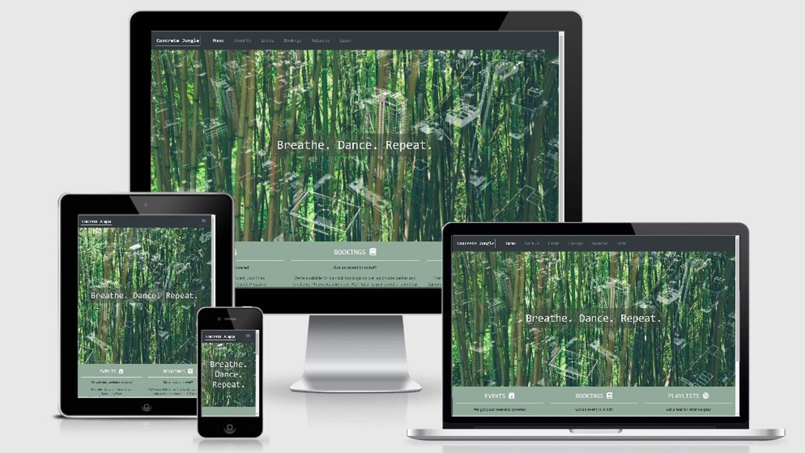

<h1 align="center"><strong>Concrete Jungle DJ Collective Website</strong></h1>

[View live project here](https://jonathanmeaney-lmk.github.io/Concrete-Jungle/index.html)

Concrete Jungle is a Madrid-based collective of DJs that organize and run music events for 
both public and private functions. This website is a marketing and branding tool for Concrete Jungle that
allows visitors to discover more about the collective and what kind of music they play, and keep up to date with upcoming 
events. Visitors can also use to site to make bookings for public and private functions, subscribe to regular updates by email 
and access links to listen to Concrete DJ mixes and themed Spotify playlists.

<h2 align="center"></h2>

## UX
----

-   ### <strong>User Stories</strong>
The website has been built for two main types of users:
1. Fans of the collective or first-time visitors that want to learn more about Concrete Jungle, discover new music, 
keep up to date with events and subscribe to join the growing community.
2. Event organisers who want to book Concrete Jungle for both public and private events, 
e.g club nights, bar events, PR events, weddings, parties or other private functions.

As mentioned in the intro, the website has been designed to contain features that allow both user types 
to easily achieve what they have come to the site for. 

The site has been designed considering UX design principles to allow users to easily navigate the website and 
find what they want. The color scheme, imagery, fonts have been chosen in order to ensure a positive user experience, while also adhering to the style, values
and branding direction of Concrete Jungle. The website has been built to be responsive to ensure a positive user experience 
across all device types.

The intial wireframes mock ups for each device type can be viewed here: [large screen](wireframes/wireframes-large.pdf), [mobile](wireframes/wireframes-mobile.pdf), [tablet](wireframes/wireframes-tablet.pdf)

- ### <strong>User Stories/Functionality</strong>
    - <strong>As a user, I want to learn more about Concrete Jungle:</strong>
        - From the homepage, users can easily navigate to the 'About Us' section to learn more about Concrete Jungle; they can
        easily navigate to the 'Listen' section to discover more of the type of music they play ('Listen' section functionality explained in more detail below)
        - On the homepage features section, users can immediately see upcoming events and get a brief description of what Concrete Jungle is about from the 'Bookings' and 'Listen' features.
        - On the footer section, users can also find contact details (in case they want to get in touch to find out more) and links to Concrete Jungle's social media pages, 
        where they can discover more media content (presently, aside from the Instagram page, all of those are test pages, but have been included to demonstrate functionality)
    - <strong>As a user, I want to find out more about upcoming events and buy tickets</strong>
        - When landing on the homepage, users can immediately see info on upcoming events, where the 'Get tix/more info' button guides them to the 'Upcoming Events' section. They can also reach the 'Upcoming Events' section 
        from the navigation bar.
        - 'Upcoming Events' lists Concrete Jungle's upcoming events. Features here include: a 'Get Tix' Button which directs users to an external page to buy tickets (currently, the external page 
        is just a [test page](https://www.residentadvisor.net/events/1389754) that has been included to demonstrate functionality)
        - Another interesting feature on this page allows users to discover more about Guest DJs. In the events which include a guest DJ, a link has been included to their Soundcloud or Mixcloud pages, 
        which allows users to listen to their mixes and original music. 
    - <strong>As a user, I want to book Concrete Jungle for an event</strong>
        - From the homepage users can easily reach the 'Bookings' section in two ways: (i) From the Navigation Bar or (ii) From the 'Bookings' feature on the homepage (where a 'Make Booking' button has been included)
        - The 'Bookings' section contains an bookings form that is easy to fill out, where users are required to enter their name, email, event type, date. They can also include any additional info before pressing
        the 'Book Now' button to complete the booking proccess. 
    - <strong>As a user, I want to hear more of the music Concrete Jungle play, download/listen to Spotify playlists or live mixes</strong>
        - From the homepage users can easily navigate to the 'Listen' section in two ways: (i) From the navigation bar or (ii) From the 'Playlists' feature on the homepage (where a 'Go to Playlists' button has been included)
        - From the 'Listen' section, 'Mixes' and 'Playlists' are devided into two clear sections. Each section contains a link to the external mix/or playlist with an eye-catching icon reprsentative of the mix/playlist in question.
        - For mixes, users are redirected (in a seperate tab) to a mixcloud page containing the mix in question; for Spotify Playlists, users are redirected (in a seperate tab) to the Spotify Website or App and playlist in question (some of these links are test links, but 
        have been included to demonstrate functionality)
    - <strong>As a user, I want a sign up to the Concrete Jungle's mailing list</strong>
        - Users can easily find the 'Sign Up' section from the navigation bar.
        - The 'Sign Up' section contains a sign-up form that is easy to fill out, where users are required to enter their name and email.
        - A check box form section is included to allow users to specify what they are interested in receiving, i.e. Upcoming Event Lists, Gig Ticket Discounts, 
        Spotify Playlists, Monthly Music Blog, Weekly Top 5 Vinyls. 
    

-   ### <strong>Design</strong>
    -   #### Colour Scheme
        -   The three main colours used are black, green and white.
    -   #### Typography
        -   The Roboto Mono is a striking and appealing font used for the Concrete Jungle logo and headings throughout the site (with Monospace as a fallback). 
        -   The Montserrat font is used for main body content, a popular easy-to-read to font which combines well with Roboto Mono (with Sans Serif as a fallback). 
    -   #### Imagery
        -   The homepage and 'About Us' images are a merging of photos of city and jungle landscapes, in tune with the Concrete Jungle brand and designed to be eyecatching. 
        -   The rest of the imagery throughout the site are action photos of the Concrete Jungle DJs playing live. These photos are in black and white to align with the style and general color scheme of the website.   

## Technologies Used
-----
### <strong>Languages Used</strong>

-   [HTML5](https://en.wikipedia.org/wiki/HTML5)
-   [CSS3](https://en.wikipedia.org/wiki/Cascading_Style_Sheets)

### <strong>Frameworks, Libraries & Programs Used</strong>

- [Bootstrap:](https://getbootstrap.com/)
    -   Bootstrap was used to assist with the responsiveness, positioning and styling of elements of the website.
- [Google Fonts:](https://fonts.google.com/)
    - Google fonts were used to import the 'Roboto Mono' and 'Montserrat' fonts into the style.css file which is used on all pages throughout the project.
- [Font Awesome:](https://fontawesome.com/)
    - Font Awesome was used on all pages throughout the website to add icons for aesthetic and UX purposes.
- [jQuery:](https://jquery.com/)
    - jQuery came with Bootstrap and has been used to create the navbar toggler function in JavaScript.
- [Git](https://git-scm.com/)
    - Git was used for version control by utilizing the Gitpod terminal to commit to Git and Push to GitHub.
- [GitHub:](https://github.com/)
    - GitHub is used to store the projects code after being pushed from Git.
- [Funny Photo:](https://funny.pho.to/es/double-exposure-effect/)
    - The Double Exposure effect on Funny Photo was used to merge the city-jungle photos to create the hero image on the Homepage and background image on the About Us page
- [Convert Image:](https://convertimage.net/)
    -  Convert Image was used to transform colored photos to black and white (About Us carousel images, Bookings, Subscribe, Listen and Events main/background images)
- [IMG 2 GO:](https://www.img2go.com/)
    - IMG 2 GO was used to compress large photo files (About Us Carousel Images, Bookings, Subsscribe, and Events main/background image)
- [Microsoft Photos](https://www.microsoft.com/en-us/p/microsoft-photos/9wzdncrfjbh4?activetab=pivot:overviewtab)
    - The standard Windows 10 image viewer/editor was used to resize the icon images on the listen page.
- [Balsamiq:](https://balsamiq.com/)
    - Balsamiq was used to create the wireframes during the design process.

## Testing
-------

-   The Website was tested on Google Chrome, Microsoft Edge, Firefox and Safari browsers.
-   The website was viewed on a variety of devices such as Desktop, Laptop, Tablet, iPhone 6s, iPhone SE, Huawei Y6, Huawei P9 and Samsung Phones.
-   A large amount of testing was done to ensure that all pages were linking correctly.
-   Friends and family members were asked to review the site and documentation to point out any bugs and/or user experience issues.

### <strong>Functionality Testing</strong> 

-   Navbar
    - Navbar links were checked on all pages and all working correctly
    - The navbar toggler device was checked on mobile devices and is working correctly
-   Footer
    - Each social media link was checked and all are linking to the correct page (all, except Instagram, are test pages, as mentioned in User Stories-Functionality section)
-   Homepage
    -   The three feature buttons ('Get Tix/More Info', 'Make a Booking', 'Go to Playlists') were all checked and all are linking to correct location
-   About Us Page   
    -   The carousel created using Bootstrap was checked on several devices and working correctly
-   Events Page
    - All six 'Get Tix' buttons were checked and are linking to the correct location ([Resident Advisor test page](https://www.residentadvisor.net/events/1389754), as mentioned in User Stories-Functionality section)
    - The three Links to Guest DJ Souncloud/Mixcloud pages were checked and are working correctly
-   Bookings Page
    - Bookings form was checked on several devices and all form sections are working correctly, aside from some known bugs on some devices (see below)
    - The 'Book Now' button was checked and prompts a pop-up box to confirm is complete, as intended. 
-   Subscribe Page
    - Subscribe form was checked on several devices and all form sections, including all check boxes, are working correctly, aside from some known bugs on some devices (see below)
    - The 'Sign Up' button was checked and prompts a pop-up box to confirm booking is complete, as intended. 
-   Listen Page
    - Four links in the 'Mixes' section are linking correctly to the designated Soundcloud pages.
    - Four links in the 'Playlists' section are linking correctly to the designated Spotify pages.

### <strong>Validation</strong> 

The W3C Markup Validator and W3C CSS Validator Services were used to validate every page of the project to ensure there were no syntax errors in the project.

- [W3C Markup Validator](https://jigsaw.w3.org/css-validator/#validate_by_input)
    - The Markup Validator only threw up one warning regarding the date tab on the 'Bookings' Section
        - Warning message: "The date input type is not supported in all browsers. Please be sure to test, and consider using a polyfill."
        - However, this has not been an issue on all browsers tested. 
    - One error regarding the input attribute for the 'Book Now' and 'Sign Up' buttons was highlighted and ammended (type="input" changed to type="submit").

-  [W3C CSS Validator](https://jigsaw.w3.org/css-validator/#validate_by_input)

    - No errors in the style.css file were detected after running the CSS code through the validator.

### <strong>Known Bugs</strong> 

-   On iPhone SE, the footer section is positioned incorrectly and overlaps with the forms on the 'Booking' and 'Subscribe' sections.
-   On several mobile devices, the footer jumps up behind the form when typing text into the text input areas, however it does not impede the completion of the form.
-   On Huawei Y6, the header/background images for the 'Events' and 'Bookings' sections do not load (on other Huawei devices, this bug did not occur)
-   On Firefox and Safari, the 'Robot Mono' space font used for the logo and headings is not appearing. Both browsers deploy the back-up 'Monospace' font. 

## Deployment
-----

### Development 

-   The project was developed using the [Gitpod online IDE](https://www.gitpod.io/).
-   The project was regularly commited using the Git command line interface on Gitpod.
-   After each commit, the project was pushed to Github for deployment.

### GitHub Pages

The project was deployed to GitHub Pages using the following steps...

1. Log in to GitHub and locate the [GitHub Repository](https://github.com/jonathanmeaney-lmk/Concrete-Jungle)
2. At the top of the Repository (not top of page), locate the "Settings" Button on the menu.
3. Scroll down the Settings page until you locate the "GitHub Pages" Section.
4. Under "Source", click the dropdown called "None" and select "Master Branch".
5. The page will automatically refresh.
6. Scroll back down through the page to locate the now published site [link](https://jonathanmeaney-lmk.github.io/Concrete-Jungle/index.html) in the "GitHub Pages" section.
## Credits
-----
- ### <strong>Code</strong>
    - The CSS code for the index hero image, events header image and listen header image came from [this blog post on csstricks.com](https://css-tricks.com/perfect-full-page-background-image/).
    - The HTML and CSS code used for the footer social media section was taken from the Code Institute walk-through Resume project, developed by tutor, Matt Rudge.
    - [Bootstrap4](https://getbootstrap.com/docs/4.4/getting-started/introduction/): Bootstrap Library used throughout the project mainly to make site responsive using the Bootstrap Grid System, as well as to create 
    the Bookings/Subscribe forms, the Navbar, the About Us and Carousel, as well as style and position various elements throughout the website.   

- ### <strong>Content</strong>

    - All content was written by the developer, Jonathan Meaney.  

- ### <strong>Imagery</strong>

    - Homepage hero image is an amalgamation of two photos:
        - ['Concrete Jungle' by Jonathan Gross](https://www.flickr.com/photos/jonathangrossphotography/17377335542)
        - ['Bamboo Nature Forest' - Pixabay free image, no attribution required](https://pixabay.com/photos/bamboo-forest-nature-green-plant-828703/)
    - 'About Us' background image is an amalgamation of two photos:
        - ['Jungle' by Cameron Wong](https://www.flickr.com/photos/cwongie/6058827175/in/photolist-aep5ev-6pSueh-o5vwEY-6ErAeC-7ZJZ2s-7ZFQxH-7ZFPp4-6wai2X-gMw5dc-5CRYaA-96nXEg-a6ENBh-ebDZyJ-99GEeD-W4pd5t-Fk8XMC-4fbYBJ-256uCLX-k8YEp-7VKe67-62y9C3-4htT7X-6mpdjD-sPBL6-nJYdY-Eq57rz-6CV9iH-9MHawL-k8Ykr-6Qs7w7-bVNdeV-4hT8XE-9cSb51-5EiqA-5Prnqr-8TikYy-sPBBZ-Fe38Vg-8TimuL-EpJ1ru-7T1a8e-8Tip9U-8Tinzy-EUSnuN-Fk95c1-8Tffsg-8Tfg7K-8TipgW-8Tinn5-Fe37Y6)
        - ['New York City' by Man Alive!](https://www.flickr.com/photos/manalive/21324818408/in/photolist-yupgyU-FtnRpy-25RjZ3n-amM1V4-B3Fx9C-hdG6aA-48bRjX-aaEYRf-7kW6Qg-61MKUf-7mWrsu-Gvju8T-5SJTLM-7q6rFZ-AJBhVv-aEYag8-aEYiw4-aFuf8z-aF39ih-29DuCi-S6v5aA-yML7J8-S6DAJG-2eMzeFW-J8vkN9-Di1FyQ-aEYaMk-HUXSDx-aEYfdZ-9A4SDf-qPWyxQ-qJrMyk-6ffrz3-217vtMM-ZkDXjY-aF35n9-k3v1-aaCaE2-7q6tQ2-29QPZqW-8XvGni-acVfZh-5h3zxR-mi7W-JB2VjM-dEXJak-2cyagEN-67v62E-TSwZ68-8YgGYd/)
    - 'Listen' Section Icon Images:
        -  Disco-Boogie: ['Doing it in Lagos' Album Cover Photo](https://soundwayrecords.bandcamp.com/album/doing-it-in-lagos)
        -  Afrobeat-Tropcial Icon: ['FK TRUMPET' by The Arches](https://www.flickr.com/photos/thearches/5178535041)
        -  Brazilian Quarantine: ['Brazilian Music Flag' by Pedro Henrique Corrêa](https://www.flickr.com/photos/pedrohcorrea/14188996853/in/photostream/)
        -  CJ Live House Set: [Photo by Achi Raz](https://www.flickr.com/photos/achi/2981500676/)
        -  Mood Board: ['Concrete Jungle from the Peak' by Ankur Panchbudhe](https://www.flickr.com/photos/ankurp/3514836742)
        -  Hip Hop Running: ['Illmatic' Album Cover](https://en.wikipedia.org/wiki/Illmatic)
        -  Soul Deep Beauties: ['Nuyorican Soul' Album Cover](https://en.wikipedia.org/wiki/Nuyorican_Soul_(album))
        -  Brazilian Barbecue: ['Ipanema Beach, Rio de Janeiro' free photo on Needpix.com - no attribution required](https://www.needpix.com/photo/1436381/ipanemabeach-riodejaneiro-brazilian-brazil-carioca)
    - Concrete Jungle DJ Photos: All photos were taken by photographer Virginia Santos, for which the developer has rights to use.
